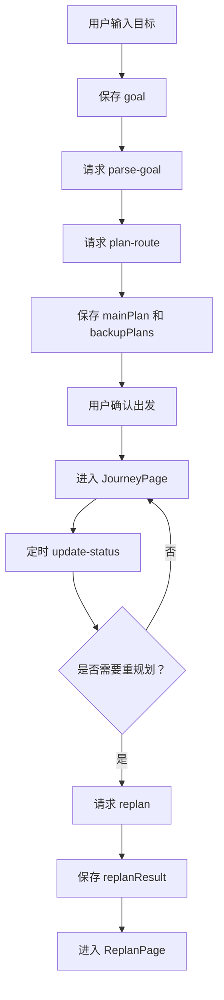

# “途变”全域行程自适应 Agent 开发文档

## 1. 文档说明

本文档用于指导“途变”HarmonyOS 应用的开发实现，面向项目开发成员。文档基于当前 `233` 项目目录下已有的需求文档、计划文档、流程图和学习清单整理，重点说明：

- 项目工程结构；
- HarmonyOS 客户端页面实现；
- Agent 决策引擎实现；
- 数据模型与接口约定；
- 真实数据接入方式；
- 状态机与重规划逻辑；
- UI 开发规范；
- 调试、测试与验收流程。

## 2. 项目技术选型

### 2.1 客户端

| 技术 | 用途 |
|---|---|
| DevEco Studio | HarmonyOS 应用开发环境 |
| ArkTS | 页面逻辑、状态管理、数据处理 |
| ArkUI | 声明式 UI 开发 |
| Ability | 应用页面与生命周期组织 |
| Preferences | 本地存储用户偏好与最近行程 |
| HTTP 请求 | 调用后端 Agent 服务、天气和地图接口 |
| 定位能力 | 获取用户当前位置 |
| 通知能力 | 出发、换乘、重规划提醒 |

### 2.2 后端与 Agent

第一版可选择以下任一方案：

- **方案 A：Python FastAPI**
  - 适合快速开发规则引擎、状态机、数据处理和 AI 调用；
  - 推荐用于比赛 MVP。

- **方案 B：Node.js Express**
  - 适合前后端统一 JavaScript/TypeScript 技术栈；
  - 如果团队更熟悉 JS，可选择该方案。

本文档后续接口设计与伪代码不绑定具体后端语言。

### 2.3 外部数据

| 数据 | 推荐接入方式 | MVP 要求 |
|---|---|---|
| 天气 | 和风天气、高德天气或华为相关天气能力 | 至少接入 1 个 |
| 地图路线 | 高德地图、百度地图或华为地图能力 | 至少接入 1 个 |
| 定位 | HarmonyOS 定位能力 | 必做 |
| 行程 | 手动录入，OCR 作为选做 | 手动录入必做 |

## 3. 项目目录建议

### 3.1 总目录结构

建议项目分为客户端、后端、文档三个部分：

```text
tubian/
├─ app/                         # HarmonyOS 客户端
│  ├─ entry/
│  │  ├─ src/
│  │  │  ├─ main/
│  │  │  │  ├─ ets/
│  │  │  │  │  ├─ entryability/
│  │  │  │  │  ├─ pages/
│  │  │  │  │  ├─ components/
│  │  │  │  │  ├─ models/
│  │  │  │  │  ├─ services/
│  │  │  │  │  ├─ stores/
│  │  │  │  │  └─ utils/
│  │  │  │  └─ resources/
│  │  └─ build-profile.json5
├─ server/                      # Agent 后端服务
│  ├─ app/
│  │  ├─ api/
│  │  ├─ core/
│  │  ├─ models/
│  │  ├─ services/
│  │  └─ utils/
│  ├─ requirements.txt
│  └─ README.md
├─ docs/                        # 项目文档
│  ├─ 需求文档.md
│  ├─ 开发文档.md
│  ├─ 计划.md
│  └─ 项目流程图.md
└─ README.md
```

### 3.2 HarmonyOS 客户端目录说明

```text
ets/
├─ pages/
│  ├─ HomePage.ets              # 首页/目标输入页
│  ├─ ConstraintPage.ets        # 约束补充页
│  ├─ PlanPage.ets              # 行程方案页
│  ├─ JourneyPage.ets           # 行程状态页
│  ├─ ReplanPage.ets            # 重规划提醒页
│  ├─ SettingsPage.ets          # 权限与设置页
│  └─ SummaryPage.ets           # 到达总结页
├─ components/
│  ├─ RouteCard.ets             # 路线卡片
│  ├─ TimelineView.ets          # 行程时间轴
│  ├─ AlertCard.ets             # 风险提醒卡片
│  ├─ PlanBCard.ets             # Plan B 卡片
│  ├─ StatusBadge.ets           # 阶段状态标签
│  └─ ActionBar.ets             # 底部操作栏
├─ models/
│  ├─ TravelGoal.ets            # 用户目标模型
│  ├─ RoutePlan.ets             # 路线方案模型
│  ├─ JourneyState.ets          # 旅程状态枚举
│  └─ ReplanResult.ets          # 重规划结果模型
├─ services/
│  ├─ ApiService.ets            # 后端接口请求
│  ├─ LocationService.ets       # 定位服务
│  ├─ NotificationService.ets   # 通知提醒
│  └─ StorageService.ets        # 本地存储
├─ stores/
│  └─ JourneyStore.ets          # 全局行程状态
└─ utils/
   ├─ TimeUtil.ets              # 时间处理
   ├─ FormatUtil.ets            # 文本格式化
   └─ RiskUtil.ets              # 风险等级辅助函数
```

## 4. 页面开发说明

### 4.1 首页/目标输入页

文件建议：`HomePage.ets`

#### 功能

- 展示 App 名称和当前定位状态；
- 提供一句话目标输入框；
- 提供快捷场景标签；
- 点击“开始规划”后进入约束补充或直接请求目标解析接口。

#### UI 结构

```text
顶部：途变 + 当前城市
中部：一句话输入框
中部：快捷标签
底部：开始规划按钮
```

#### 关键交互

- 输入为空时，开始按钮置灰；
- 点击快捷标签后，将标签内容追加到输入中；
- 如果用户未授权定位，提示授权但不阻塞输入。

### 4.2 约束补充页

文件建议：`ConstraintPage.ets`

#### 功能

- 补充预算；
- 选择是否带行李；
- 选择出行偏好；
- 选择是否接受网约车；
- 确认后请求路线规划接口。

#### 偏好选项

```text
准时优先 / 省钱优先 / 少步行 / 少换乘 / 舒适优先
```

### 4.3 行程方案页

文件建议：`PlanPage.ets`

#### 功能

- 展示主方案；
- 展示 Plan B；
- 展示预计到达时间、费用、耗时、风险；
- 用户确认后进入行程状态页。

#### 页面组件

- `TimelineView`
- `RouteCard`
- `PlanBCard`
- `AlertCard`
- `ActionBar`

### 4.4 行程状态页

文件建议：`JourneyPage.ets`

#### 功能

- 展示当前旅程阶段；
- 展示下一步动作；
- 展示当前路线状态；
- 定时或手动触发状态更新；
- 如检测到计划失效，跳转重规划提醒页。

#### 当前阶段示例

```text
出发准备 / 去车站 / 候车 / 乘车 / 到站换乘 / 前往目的地 / 入场或入住准备 / 已抵达
```

### 4.5 重规划提醒页

文件建议：`ReplanPage.ets`

#### 功能

- 展示触发原因；
- 对比原方案和新方案；
- 展示额外费用、预计到达时间；
- 提供“切换方案”和“暂不切换”按钮。

#### 示例文案

```text
原计划预计 19:12 到达，已超过 19:00 入场要求。
建议切换为网约车方案，预计 18:48 到达，费用增加约 42 元。
```

### 4.6 权限与设置页

文件建议：`SettingsPage.ets`

#### 功能

- 定位权限说明；
- 通知权限说明；
- 相册/OCR 权限说明；
- 常用偏好设置；
- 清除本地行程数据。

### 4.7 到达总结页

文件建议：`SummaryPage.ets`

#### 功能

- 展示最终到达时间；
- 展示总耗时、总费用；
- 展示 Agent 作出的关键决策；
- 支持再次规划。

## 5. UI 实现规范

### 5.1 视觉风格

整体风格要求：

- 简约；
- 清爽；
- 信息层级清晰；
- 操作按钮明确；
- 不使用复杂装饰；
- 重点突出“下一步行动”。

### 5.2 色彩规范

| 用途 | 色值 |
|---|---|
| 背景 | `#F7F9FC` |
| 卡片 | `#FFFFFF` |
| 主文字 | `#1F2937` |
| 次级文字 | `#6B7280` |
| 主色 | `#2563EB` |
| 正常 | `#16A34A` |
| 风险 | `#F97316` |
| 紧急 | `#DC2626` |
| 分割线 | `#E5E7EB` |

### 5.3 组件规范

| 组件 | 要求 |
|---|---|
| 卡片 | 圆角 8px，浅边框或轻阴影 |
| 按钮 | 主按钮使用蓝色，危险操作使用红色 |
| 标签 | 使用小尺寸圆角标签，避免过多颜色 |
| 时间轴 | 左侧时间，右侧事件内容 |
| 风险提醒 | 橙色或红色突出，但文案保持克制 |
| 页面留白 | 内容区左右留白建议 16-20vp |

### 5.4 文案规范

文案要短、明确、可执行。

推荐：

```text
建议现在出发
原计划可能赶不上
切换为网约车方案
预计 18:48 到达
费用增加约 42 元
```

避免：

```text
系统检测到当前复杂路径条件发生多重不确定变化，请用户自行综合判断后续策略。
```

## 6. 数据模型

### 6.1 TravelGoal

```ts
interface TravelGoal {
  origin: string
  destination: string
  departureTime?: string
  deadline: string
  budget?: number
  luggage: boolean
  preference: TravelPreference
  companions?: Companion[]
}
```

### 6.2 TravelPreference

```ts
type TravelPreference =
  | '准时优先'
  | '省钱优先'
  | '少步行'
  | '少换乘'
  | '舒适优先'
```

### 6.3 RoutePlan

```ts
interface RoutePlan {
  planId: string
  type: '主方案' | 'Plan B' | '重规划方案'
  eta: string
  cost: number
  durationMinutes: number
  walkDistanceMeters: number
  transferCount: number
  riskLevel: '低' | '中' | '高'
  segments: RouteSegment[]
  reason: string
}
```

### 6.4 RouteSegment

```ts
interface RouteSegment {
  mode: '高铁' | '地铁' | '公交' | '步行' | '网约车'
  from: string
  to: string
  startTime?: string
  endTime?: string
  durationMinutes: number
  distanceMeters?: number
  cost?: number
  note?: string
}
```

### 6.5 JourneyState

```ts
type JourneyState =
  | '出发准备'
  | '去车站'
  | '候车'
  | '乘车'
  | '到站换乘'
  | '前往目的地'
  | '入场或入住准备'
  | '已抵达'
```

### 6.6 ReplanResult

```ts
interface ReplanResult {
  trigger: string
  oldPlanStatus: string
  newPlan: RoutePlan
  extraCost: number
  action: string
  explanation: string
}
```

## 7. 前端状态管理

### 7.1 JourneyStore 字段

```ts
interface JourneyStore {
  goal?: TravelGoal
  mainPlan?: RoutePlan
  backupPlans: RoutePlan[]
  currentPlan?: RoutePlan
  currentState: JourneyState
  replanResult?: ReplanResult
  locationEnabled: boolean
  notificationEnabled: boolean
  loading: boolean
  errorMessage?: string
}
```

### 7.2 状态更新流程



## 8. 后端接口约定

### 8.1 通用响应格式

```json
{
  "success": true,
  "data": {},
  "message": ""
}
```

错误响应：

```json
{
  "success": false,
  "data": null,
  "message": "地图接口调用失败，请稍后重试"
}
```

### 8.2 目标解析接口

```http
POST /api/parse-goal
```

请求：

```json
{
  "text": "我明天从杭州东站去上海看演唱会，带一个行李箱，预算300元，晚上7点前必须入场"
}
```

响应：

```json
{
  "success": true,
  "data": {
    "origin": "杭州东站",
    "destination": "上海演唱会场馆",
    "deadline": "19:00",
    "budget": 300,
    "luggage": true,
    "preference": "准时优先"
  },
  "message": ""
}
```

### 8.3 路线规划接口

```http
POST /api/plan-route
```

请求：

```json
{
  "goal": {
    "origin": "杭州东站",
    "destination": "上海演唱会场馆",
    "deadline": "19:00",
    "budget": 300,
    "luggage": true,
    "preference": "准时优先"
  },
  "location": {
    "lat": 30.246,
    "lng": 120.210
  }
}
```

响应：

```json
{
  "success": true,
  "data": {
    "mainPlan": {},
    "backupPlans": [],
    "riskTips": [
      "目的地可能出现降雨，建议减少步行距离"
    ]
  },
  "message": ""
}
```

### 8.4 状态更新接口

```http
POST /api/update-status
```

响应字段：

- `currentState`：当前旅程阶段；
- `nextAction`：下一步动作；
- `needReplan`：是否需要重规划；
- `reason`：触发原因。

### 8.5 重规划接口

```http
POST /api/replan
```

响应字段：

- `newPlan`；
- `extraCost`；
- `action`；
- `explanation`；
- `riskLevel`。

## 9. Agent 决策模块实现

### 9.1 模块结构

```text
server/app/core/
├─ goal_parser.py               # 目标解析
├─ route_planner.py             # 路线生成
├─ route_scorer.py              # 路线评分
├─ plan_b.py                    # Plan B 生成
├─ journey_state_machine.py     # 旅程状态机
├─ replanner.py                 # 重规划
└─ explanation.py               # 推荐原因生成
```

### 9.2 目标解析

第一版可先使用规则 + 表单兜底：

```text
自然语言输入 -> 正则/关键词提取 -> 缺失字段进入表单补充 -> 生成 TravelGoal
```

后续可接入大模型：

```text
自然语言输入 -> 大模型结构化 JSON -> 字段校验 -> 缺失字段补充
```

### 9.3 路线评分伪代码

```python
def score_route(route, goal, context):
    score = 100

    if route.eta > goal.deadline:
        score -= 50

    if goal.budget and route.cost > goal.budget:
        score -= 20

    if goal.luggage and route.walk_distance_meters > 800:
        score -= 15

    if context.weather in ["暴雨", "大雨"] and route.walk_distance_meters > 500:
        score -= 20

    if route.transfer_count >= 3:
        score -= 10

    if goal.preference == "准时优先":
        score += route.on_time_probability * 20

    return score
```

### 9.4 Plan B 生成规则

| 触发条件 | 生成方案 |
|---|---|
| `eta > deadline` | 准时优先方案 |
| `weather == 暴雨` | 少步行方案 |
| `luggage == true && walkDistance > 800` | 网约车接驳方案 |
| `departLateMinutes > 10` | 压缩换乘、提高打车权重 |
| `transferCount >= 3` | 少换乘方案 |

### 9.5 状态机伪代码

```python
def get_journey_state(now, location, plan):
    if not plan.started:
        return "出发准备"
    if near(location, plan.origin_station):
        return "候车"
    if plan.on_train:
        return "乘车"
    if near(location, plan.arrival_station):
        return "到站换乘"
    if near(location, plan.destination):
        return "入场或入住准备"
    if plan.arrived:
        return "已抵达"
    return "前往目的地"
```

### 9.6 重规划伪代码

```python
def should_replan(current_plan, goal, context):
    if current_plan.eta > goal.deadline:
        return True, "预计到达时间超过截止时间"

    if context.weather in ["暴雨", "大雨"] and current_plan.walk_distance_meters > 500:
        return True, "天气恶劣且步行距离过长"

    if goal.luggage and current_plan.walk_distance_meters > 1000:
        return True, "携带行李且步行距离过长"

    return False, ""
```

## 10. 真实数据接入

### 10.1 天气数据

#### 需要字段

```json
{
  "city": "上海",
  "weather": "暴雨",
  "temperature": 28,
  "warning": "暴雨黄色预警"
}
```

#### 使用方式

- 判断是否降雨；
- 判断是否高温；
- 判断是否有恶劣天气预警；
- 影响路线评分和 Plan B。

### 10.2 地图路线数据

#### 需要字段

```json
{
  "mode": "transit",
  "durationMinutes": 42,
  "distanceMeters": 12600,
  "walkDistanceMeters": 850,
  "transferCount": 2,
  "cost": 6
}
```

#### 使用方式

- 生成候选路线；
- 计算预计到达时间；
- 计算步行距离；
- 判断是否需要改打车或少换乘。

### 10.3 定位数据

#### 需要字段

```json
{
  "lat": 30.246,
  "lng": 120.210,
  "accuracy": 30,
  "timestamp": 1721548800000
}
```

#### 使用方式

- 判断是否已经出发；
- 判断是否到达车站；
- 判断是否接近目的地；
- 判断是否偏离路线。

## 11. 权限与隐私实现

### 11.1 权限申请时机

| 权限 | 申请时机 |
|---|---|
| 定位 | 用户点击“开始规划”或“开始出行”时 |
| 通知 | 用户确认行程后 |
| 相册 | 用户点击“导入截图”时 |
| 日历 | 用户点击“导入日历”时 |

### 11.2 权限说明页面文案

定位权限：

```text
用于判断你是否已经出发、是否接近换乘点或目的地，从而提供出发和重规划提醒。
```

通知权限：

```text
用于在出发、换乘、天气突变或计划失效时提醒你。
```

相册权限：

```text
仅在你主动选择行程截图时使用，用于识别车次和时间信息。
```

### 11.3 数据存储原则

- 只保存当前行程和用户偏好；
- 不保存长期定位轨迹；
- 不上传无关个人信息；
- 提供清除本地数据入口；
- 自动交易相关功能不在第一版实现。

## 12. 前后端联调流程

### 12.1 Mock 阶段

前端先使用本地 Mock 数据：

```text
HomePage -> ConstraintPage -> PlanPage -> JourneyPage -> ReplanPage -> SummaryPage
```

目标：

- 页面流程可跑通；
- 时间轴和卡片展示正常；
- 按钮跳转正常；
- 视觉风格统一。

### 12.2 接口联调阶段

联调顺序：

1. `/api/parse-goal`
2. `/api/plan-route`
3. `/api/update-status`
4. `/api/replan`

每个接口都需要测试：

- 正常数据；
- 缺失字段；
- API 失败；
- 网络异常；
- 后端返回空结果。

### 12.3 真机调试阶段

重点验证：

- 定位权限申请；
- 当前位置获取；
- 通知权限申请；
- 页面在真机尺寸下是否溢出；
- 长文本是否换行；
- 弹窗是否遮挡核心信息。

## 13. 测试用例

### 13.1 基础流程测试

| 用例 | 输入 | 预期结果 |
|---|---|---|
| 正常规划 | 杭州东站到上海演唱会，19:00 前入场 | 生成主方案和 Plan B |
| 缺少预算 | 未输入预算 | 引导补充或使用默认策略 |
| 缺少目的地 | 未输入目的地 | 提示用户补充 |
| 带行李 | 行李为 true | 降低长步行方案评分 |
| 准时优先 | preference 为准时优先 | 优先推荐准时率高的路线 |

### 13.2 重规划测试

| 用例 | 条件 | 预期结果 |
|---|---|---|
| 暴雨 | 天气为暴雨且步行大于 500 米 | 推荐少步行方案 |
| 出门晚 | 当前时间晚于计划 10 分钟 | 推荐准时优先方案 |
| 到达超时 | ETA 晚于 deadline | 触发重规划 |
| 费用超预算 | 新方案费用超过预算 | 提示额外费用 |
| 定位失败 | 无法获取当前位置 | 允许手动选择当前位置 |

### 13.3 UI 测试

| 测试点 | 验收标准 |
|---|---|
| 首页 | 输入框、标签、按钮清晰可用 |
| 方案页 | 时间轴不拥挤，费用和 ETA 明显 |
| 重规划页 | 原方案和新方案对比清楚 |
| 设置页 | 权限说明明确 |
| 长文本 | 不溢出、不遮挡、不重叠 |

## 14. 开发顺序建议

### 第 1 步：搭建基础工程

- 创建 HarmonyOS 项目；
- 创建页面文件；
- 建立基础路由；
- 创建通用组件；
- 创建 Mock 数据。

### 第 2 步：完成静态 UI

- 首页；
- 约束补充页；
- 行程方案页；
- 行程状态页；
- 重规划提醒页；
- 总结页。

### 第 3 步：实现前端状态

- 定义数据模型；
- 创建 JourneyStore；
- 实现页面间传值；
- 使用 Mock 数据跑通主流程。

### 第 4 步：搭建后端接口

- parse-goal；
- plan-route；
- update-status；
- replan；
- explain。

### 第 5 步：实现 Agent 规则

- 路线评分；
- Plan B 生成；
- 状态机；
- 重规划判断；
- 推荐原因生成。

### 第 6 步：接入真实数据

- 定位；
- 天气；
- 地图路线；
- 手动行程录入。

### 第 7 步：联调与优化

- 接口联调；
- 异常兜底；
- 真机调试；
- UI 微调；
- 演示流程录制。

## 15. MVP 完成标准

MVP 完成时，至少应具备：

- 用户可输入行程目标；
- 系统可生成主方案；
- 系统可生成 Plan B；
- 页面可展示时间轴、路线卡片、风险提醒；
- 可模拟或真实触发暴雨/出门晚/ETA 超时；
- 可进入重规划提醒页；
- 可展示新方案和原因；
- 可展示到达总结；
- UI 风格简约统一；
- 至少接入定位、天气、地图中的两项真实能力。

## 16. 演示脚本建议

演示流程：

```text
1. 打开途变 App
2. 输入：我明天从杭州东站去上海看演唱会，带一个行李箱，预算300元，晚上7点前必须入场
3. 系统识别目标并补充偏好
4. 展示高铁 + 地铁 + 步行主方案
5. 展示高铁晚点后的网约车 Plan B
6. 触发暴雨事件
7. 系统判断步行风险升高
8. 推荐改为网约车到室内入口
9. 展示额外费用和预计到达时间
10. 显示最终准时到达总结
```

## 17. 常见风险与处理

| 风险 | 处理方式 |
|---|---|
| 地图 API 申请或调用失败 | 使用 Mock 路线或手动路线作为兜底 |
| 天气 API 不稳定 | 使用缓存天气或演示固定城市天气 |
| 定位真机调试失败 | 增加手动当前位置选项 |
| 大模型输出不稳定 | 强制 JSON 格式并做字段校验 |
| 时间不足 | 优先保证主链路，砍掉 OCR、日历、同行协作 |
| UI 内容过多 | 每页只突出一个主任务和一个主按钮 |

## 18. 提交物清单

开发完成后建议提交：

- HarmonyOS 客户端代码；
- Agent 后端代码；
- 接口文档；
- 需求文档；
- 开发文档；
- 项目流程图；
- 测试记录；
- 答辩 PPT；
- 演示视频。

