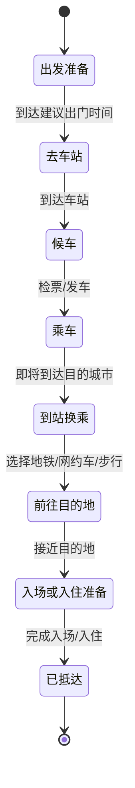
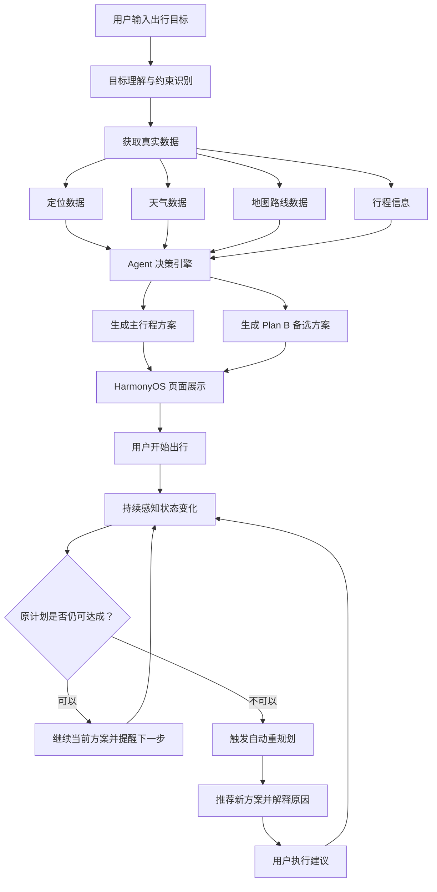

# “途变”全域行程自适应 Agent 鸿蒙应用开发需求文档

## 1. 项目概述

### 1.1 项目名称

**途变：全域行程自适应 Agent**

### 1.2 项目定位

“途变”是一款基于 HarmonyOS 开发的真实动态出行助手应用。它不只是帮用户生成一份静态攻略，而是在用户出行计划不断变化时，结合定位、天气、地图路线、行程时间和用户偏好，主动判断原计划是否仍然可行，并给出安全、准时、舒适的下一步行动建议。

### 1.3 一句话目标

**做一个基于 HarmonyOS 的真实动态出行 Agent，在用户行程变化时主动提醒、自动重规划，并给出安全、准时、舒适的下一步行动。**

### 1.4 核心价值

真实出行中，用户经常需要同时查看地图、天气、订票、日历、攻略等多个 App。“途变”的价值是把这些分散信息整合成一个连续的出行决策闭环：

```text
输入目标 -> 理解约束 -> 获取真实数据 -> 生成主方案 -> 预置 Plan B -> 持续感知变化 -> 自动重规划 -> 提醒用户执行
```

## 2. 用户痛点

### 2.1 现有问题

- 地图 App 主要解决路线导航，但不关心完整旅行目标；
- 天气 App 只提供天气信息，不会自动调整路线；
- 订票 App 只管理订单，不负责后续换乘；
- 攻略 App 偏静态推荐，无法处理突发变化；
- 用户需要在多个 App 间来回切换并自行判断。

### 2.2 典型痛点场景

| 场景 | 用户问题 | 途变解决方式 |
|---|---|---|
| 高铁晚点 | 原计划地铁换乘可能赶不上 | 自动切换到站后网约车方案 |
| 暴雨天气 | 原路线步行距离过长 | 减少步行，推荐室内下车点 |
| 出门晚了 | 原计划无法准时到达 | 切换为准时优先策略 |
| 带大件行李 | 长距离换乘体验差 | 降低多换乘、长步行路线评分 |
| 多人同行 | 集合点、到达时间难协调 | 支持共享集合点和 ETA 作为扩展 |
| 夜间到达 | 安全风险更高 | 优先推荐更安全、更直接路线 |

## 3. 目标用户与使用场景

### 3.1 目标用户

- 跨城出行用户；
- 参加演唱会、展会、考试、面试等有明确截止时间的用户；
- 需要换乘高铁、地铁、步行、网约车的用户；
- 携带行李、老人儿童或多人同行的用户；
- 对准时、安全、舒适要求较高的用户。

### 3.2 核心演示场景

用户输入：

> 我明天从杭州东站去上海看演唱会，带一个行李箱，预算 300 元，晚上 7 点前必须入场。

系统输出：

- 识别出发地、目的地、截止时间、预算、行李和偏好；
- 生成“高铁 + 地铁 + 步行”的主方案；
- 预置“高铁晚点后改网约车”的 Plan B；
- 若天气变为暴雨，取消长距离步行；
- 若用户出门晚，自动切换准时优先策略；
- 最终给出预计到达时间、费用变化和下一步行动。

## 4. 产品范围

### 4.1 第一版必做范围

| 模块 | 功能 | 优先级 |
|---|---|---|
| 目标输入 | 支持自然语言或表单输入出行目标 | P0 |
| 约束识别 | 提取时间、地点、预算、行李、偏好 | P0 |
| 主方案生成 | 生成地铁/公交、步行、网约车、高铁录入组合方案 | P0 |
| Plan B 生成 | 针对晚点、暴雨、出门晚生成备选方案 | P0 |
| 真实数据接入 | 接入天气、地图路线、定位中的至少两项 | P0 |
| 旅程状态机 | 判断出发准备、途中、换乘、到达等阶段 | P0 |
| 动态重规划 | 判断原计划失效并给出新方案 | P0 |
| 提醒展示 | 展示弹窗、卡片或通知提醒 | P0 |
| HarmonyOS UI | 完成简约美观的移动端页面 | P0 |

### 4.2 第一版选做范围

| 模块 | 功能 | 优先级 |
|---|---|---|
| OCR 导入 | 支持行程截图识别车次、时间、地点 | P1 |
| 日历导入 | 支持从日历读取演出、酒店、返程时间 | P1 |
| 外部跳转 | 一键打开地图、打车或日历 | P1 |
| 服务卡片 | 在桌面卡片展示下一步行动 | P1 |
| 小艺入口 | 后续通过语音或智能体入口创建行程 | P2 |
| 同行协作 | 共享 ETA、集合点、位置状态 | P2 |

### 4.3 第一版暂不实现

- 自动购票；
- 自动改签；
- 自动下单网约车；
- 多城市全量实时公交数据；
- 复杂账户体系；
- 大规模云端用户数据存储。

第一版重点是：**建议、提醒、跳转、解释原因**。

## 5. 鸿蒙应用核心页面需求

### 5.1 页面总览

| 页面 | 作用 | 核心组件 |
|---|---|---|
| 首页/目标输入页 | 输入行程目标 | 输入框、快捷标签、出发按钮 |
| 约束补充页 | 补充预算、行李、偏好 | 表单、选择器、开关、滑块 |
| 行程方案页 | 展示主方案和 Plan B | 时间轴、路线卡片、费用/耗时摘要 |
| 行程状态页 | 展示当前阶段和下一步动作 | 状态卡片、进度条、提醒按钮 |
| 重规划提醒页 | 原计划失效时推荐新方案 | 风险提示、对比卡片、确认按钮 |
| 权限与设置页 | 管理定位、通知、隐私和偏好 | 权限卡片、偏好设置、数据清除 |
| 到达总结页 | 展示总耗时、总花费、关键决策 | 总结卡片、决策记录、再次规划 |

## 6. UI 设计要求

### 6.1 整体风格

UI 风格要求：**简约、美观、清晰、行动导向**。

设计关键词：

- 清爽；
- 可信任；
- 低干扰；
- 信息层级明确；
- 适合移动端快速阅读；
- 重点突出“下一步该做什么”。

### 6.2 色彩建议

建议使用中性浅色背景，搭配少量功能色：

| 用途 | 建议颜色 |
|---|---|
| 页面背景 | 浅灰白 `#F7F9FC` |
| 主文字 | 深灰黑 `#1F2937` |
| 次级文字 | 灰色 `#6B7280` |
| 主色 | 科技蓝 `#2563EB` |
| 安全/正常 | 绿色 `#16A34A` |
| 风险提醒 | 橙色 `#F97316` |
| 紧急提醒 | 红色 `#DC2626` |

### 6.3 布局原则

- 首页不做复杂营销页，打开后直接进入“创建行程”；
- 卡片圆角控制在 8px 左右，避免过度圆润；
- 页面信息按“当前状态 -> 下一步行动 -> 详细原因”排序；
- 不堆叠过多卡片，重要提醒必须显眼；
- 按钮文字简洁，例如“开始规划”“切换方案”“打开地图”；
- 列表和时间轴要支持长内容滚动；
- 移动端文字不应拥挤、重叠或超出按钮。

### 6.4 关键页面布局

#### 首页/目标输入页

页面结构：

```text
顶部：App 名称 + 当前城市/定位状态
中部：一句话目标输入框
下方：快捷场景标签
底部：开始规划按钮
```

快捷标签示例：

- 赶高铁；
- 看演唱会；
- 去机场；
- 酒店入住；
- 带行李；
- 少步行。

#### 行程方案页

页面结构：

```text
顶部：目标摘要
中部：主方案时间轴
中下：Plan B 方案卡片
底部：确认行程 / 修改偏好
```

必须展示：

- 预计到达时间；
- 总耗时；
- 预计费用；
- 步行距离；
- 换乘次数；
- 准时风险；
- 推荐理由。

#### 重规划提醒页

页面结构：

```text
顶部：风险提示
中部：原方案 vs 新方案对比
下方：原因解释
底部：确认切换 / 暂不切换
```

示例文案：

> 原计划预计 19:12 到达，已超过 19:00 入场要求。建议切换为网约车方案，预计 18:48 到达，费用增加约 42 元。

## 7. 核心功能需求

### 7.1 目标输入与理解

用户可以通过自然语言输入：

```text
我明天从杭州东站去上海看演唱会，带一个行李箱，预算 300 元，晚上 7 点前必须入场。
```

系统需要识别字段：

| 字段 | 示例 |
|---|---|
| 出发地 | 杭州东站 |
| 目的地 | 上海演唱会场馆 |
| 截止时间 | 19:00 |
| 预算 | 300 元 |
| 行李 | 一个行李箱 |
| 偏好 | 准时优先、少换乘、少步行 |
| 同行人 | 可选，老人/儿童/朋友 |

### 7.2 约束补充

如果自然语言识别不完整，系统应引导用户补充：

- 出发时间；
- 到达截止时间；
- 预算上限；
- 是否携带行李；
- 是否带老人儿童；
- 是否接受网约车；
- 是否准时优先；
- 是否少步行。

### 7.3 真实数据接入

第一版推荐接入：

| 数据 | 获取方式 | 作用 |
|---|---|---|
| 定位 | HarmonyOS 定位能力 | 判断用户当前位置和出发状态 |
| 天气 | 天气 API | 判断降雨、高温、台风等风险 |
| 地图路线 | 地图路线 API | 获取路线距离、耗时、换乘 |
| 行程信息 | 手动输入/OCR | 获取高铁、演出、酒店时间 |

### 7.4 主方案生成

系统根据用户目标生成主方案，包括：

- 交通方式组合；
- 每段出发和到达时间；
- 每段预计耗时；
- 每段费用；
- 步行距离；
- 换乘点；
- 到达概率或准时风险；
- 推荐理由。

### 7.5 Plan B 生成

系统在生成主方案时，必须同步生成 Plan B。

Plan B 触发示例：

| 触发条件 | 备选动作 |
|---|---|
| 高铁晚点超过 20 分钟 | 到站后改乘网约车 |
| 目的地暴雨 | 减少步行，改为室内下车点 |
| 用户出门晚于计划 10 分钟 | 切换准时优先方案 |
| 地图路线拥堵 | 改用地铁或绕行路线 |
| 步行距离超过阈值且有行李 | 推荐网约车接驳 |

### 7.6 旅程状态机

系统需要维护用户旅程状态。



不同阶段提醒内容：

| 阶段 | 提醒内容 |
|---|---|
| 出发准备 | 提醒出门时间、证件、雨具、行李 |
| 去车站 | 提醒预计到站时间、检票口、路线风险 |
| 候车 | 提醒车次、检票时间、晚点信息 |
| 乘车 | 提醒即将到站、下车出口、换乘方式 |
| 到站换乘 | 提醒选择地铁或网约车 |
| 前往目的地 | 提醒入口、集合点、天气影响 |
| 已抵达 | 显示总结、费用、关键决策 |

### 7.7 动态重规划

系统持续判断原计划是否失效。

判断依据：

- 当前时间；
- 当前位置；
- 预计到达时间；
- 天气变化；
- 路线耗时变化；
- 用户是否按时出发；
- 是否超过预算；
- 是否仍能满足截止时间。

重规划输出：

- 新推荐方案；
- 原方案失效原因；
- 新方案预计到达时间；
- 新方案额外费用；
- 风险变化；
- 下一步行动按钮。

### 7.8 提醒与通知

提醒类型：

- 出发提醒；
- 换乘提醒；
- 天气提醒；
- 晚点提醒；
- 重规划提醒；
- 到达提醒；
- 安全提醒。

通知原则：

- 只在关键节点提醒；
- 不频繁打扰；
- 紧急提醒使用高优先级视觉样式；
- 普通提醒使用卡片或轻提示。

### 7.9 外部应用跳转

第一版可支持：

- 打开地图 App；
- 复制目的地；
- 打开网约车 App；
- 打开日历；
- 打开天气详情页。

## 8. Agent 决策逻辑需求

### 8.1 Agent 定义

本项目中的 Agent 是系统决策大脑，负责：

- 理解用户目标；
- 获取和整合真实数据；
- 生成主方案；
- 预置 Plan B；
- 判断计划是否失效；
- 触发重规划；
- 用用户能理解的语言解释原因。

### 8.2 路线评分模型

建议使用规则引擎 + 权重评分：

| 评分维度 | 权重说明 |
|---|---|
| 准时率 | 越接近截止时间，权重越高 |
| 费用 | 不能超过用户预算太多 |
| 步行距离 | 带行李或下雨时权重提高 |
| 换乘次数 | 老人儿童或行李场景下权重提高 |
| 天气风险 | 暴雨、高温、台风时提高风险惩罚 |
| 安全性 | 夜间、偏远区域时提高权重 |
| 用户偏好 | 准时优先、省钱优先、舒适优先 |

### 8.3 推荐策略

| 当前情况 | 推荐策略 |
|---|---|
| 时间充足 | 综合考虑预算和舒适度 |
| 接近截止时间 | 准时优先 |
| 天气恶劣 | 少步行、少换乘优先 |
| 用户带行李 | 减少楼梯、长步行、多换乘 |
| 夜间出行 | 安全、直达、少等待优先 |

### 8.4 大模型使用边界

大模型用于：

- 理解自然语言目标；
- 生成推荐原因；
- 总结行程变化；
- 把技术结果转成用户可读文本。

大模型不直接决定：

- 是否一定能准时；
- 费用是否准确；
- 路线是否可通行；
- 是否自动下单或改签。

关键判断必须由规则引擎和真实数据校验。

## 9. 鸿蒙技术需求

### 9.1 开发环境

| 项目 | 要求 |
|---|---|
| IDE | DevEco Studio |
| 开发语言 | ArkTS |
| UI 框架 | ArkUI |
| 系统能力 | Ability、定位、通知、本地存储 |
| 后端通信 | HTTP/REST API |

### 9.2 客户端技术模块

| 模块 | 技术 |
|---|---|
| 页面开发 | ArkUI 声明式组件 |
| 状态管理 | ArkTS 页面状态、全局状态对象 |
| 定位 | HarmonyOS 定位能力 |
| 通知 | 系统通知能力 |
| 本地存储 | Preferences |
| 网络请求 | HTTP 请求 |
| 外部跳转 | URL Scheme / WebView |
| 权限申请 | 系统权限弹窗 + 自定义说明页 |

### 9.3 后端技术模块

第一版可二选一：

- Python FastAPI；
- Node.js Express。

后端负责：

- 目标解析；
- 路线评分；
- Plan B 生成；
- 状态机状态计算；
- 重规划结果返回；
- 调用天气和地图 API；
- 返回结构化 JSON。

## 10. 数据结构设计

### 10.1 用户目标数据

```json
{
  "origin": "杭州东站",
  "destination": "上海演唱会场馆",
  "deadline": "19:00",
  "budget": 300,
  "luggage": true,
  "preference": "准时优先",
  "companions": []
}
```

### 10.2 路线方案数据

```json
{
  "planId": "main_plan",
  "type": "主方案",
  "eta": "18:42",
  "cost": 156,
  "durationMinutes": 128,
  "walkDistanceMeters": 850,
  "transferCount": 2,
  "riskLevel": "中",
  "segments": [
    {
      "mode": "高铁",
      "from": "杭州东站",
      "to": "上海虹桥站",
      "durationMinutes": 55
    },
    {
      "mode": "地铁",
      "from": "上海虹桥站",
      "to": "场馆附近",
      "durationMinutes": 38
    }
  ],
  "reason": "预计可在 19:00 前到达，费用在预算内。"
}
```

### 10.3 重规划结果数据

```json
{
  "trigger": "暴雨 + 原步行距离过长",
  "oldPlanStatus": "风险升高",
  "newPlanId": "rain_plan_b",
  "newEta": "18:50",
  "extraCost": 42,
  "action": "建议到站后改乘网约车，并将下车点调整到场馆室内入口。",
  "explanation": "当前目的地暴雨，原方案步行 850 米，携带行李体验较差。"
}
```

## 11. 接口需求

### 11.1 目标解析接口

```http
POST /api/parse-goal
```

输入：

```json
{
  "text": "我明天从杭州东站去上海看演唱会，带一个行李箱，预算300元，晚上7点前必须入场"
}
```

输出：

```json
{
  "origin": "杭州东站",
  "destination": "上海演唱会场馆",
  "deadline": "19:00",
  "budget": 300,
  "luggage": true,
  "preference": "准时优先"
}
```

### 11.2 路线规划接口

```http
POST /api/plan-route
```

输出：

- 主方案；
- Plan B；
- 风险提示；
- 推荐理由。

### 11.3 状态更新接口

```http
POST /api/update-status
```

输出：

- 当前旅程阶段；
- 下一步动作；
- 是否需要提醒。

### 11.4 重规划接口

```http
POST /api/replan
```

输出：

- 新方案；
- 原因解释；
- 到达时间；
- 额外费用；
- 下一步操作。

## 12. 权限与隐私需求

### 12.1 需要申请的权限

| 权限 | 用途 | 是否必须 |
|---|---|---|
| 定位权限 | 判断当前位置、出发状态、是否到达 | 必须 |
| 通知权限 | 发送出发、换乘、重规划提醒 | 必须 |
| 相册权限 | OCR 导入行程截图 | 选做 |
| 日历权限 | 读取演出、酒店、返程时间 | 选做 |

### 12.2 隐私原则

- 所有敏感权限必须由用户授权；
- 权限申请前说明用途；
- 只保存必要行程信息；
- 不保存长期定位轨迹；
- 提供清除本地数据入口；
- 第一版不做自动购票、自动改签和自动下单。

## 13. 异常与兜底需求

| 异常 | 兜底方案 |
|---|---|
| 天气 API 失败 | 使用最近一次天气或提示用户手动确认 |
| 地图 API 失败 | 提供手动路线输入或简化推荐 |
| 定位失败 | 允许用户手动选择当前位置 |
| 大模型解析失败 | 切换表单输入 |
| OCR 识别失败 | 允许用户手动修改 |
| 网络异常 | 展示已缓存行程与离线提醒 |

## 14. 项目核心流程



## 15. 验收标准

### 15.1 功能验收

- 用户能够输入行程目标；
- 系统能够识别关键字段；
- 系统能够生成主方案和 Plan B；
- 页面能够展示路线时间轴、费用、耗时和风险；
- 系统能够根据突发条件触发重规划；
- 系统能够给出明确下一步行动；
- 权限说明页面完整；
- 至少接入天气、地图、定位中的两项真实数据或能力。

### 15.2 UI 验收

- 页面风格简约统一；
- 信息层级清晰；
- 关键按钮明显；
- 文字不溢出、不重叠；
- 提醒状态颜色明确；
- 移动端单手使用体验良好；
- 重要信息在首屏可见。

### 15.3 演示验收

演示需要完整跑通：

```text
输入杭州到上海演唱会目标
-> 生成主方案
-> 展示 Plan B
-> 触发暴雨或出门晚事件
-> 自动重规划
-> 展示新方案和原因
-> 显示最终到达总结
```

## 16. 版本规划

### V1.0 比赛 MVP

- 目标输入；
- 主方案；
- Plan B；
- 天气/地图/定位接入；
- 状态机；
- 重规划；
- 简约 UI；
- 演示视频与答辩材料。

### V1.1 生活可用增强版

- OCR 导入；
- 日历导入；
- 外部地图/打车跳转；
- 服务卡片；
- 更完整的异常兜底。

### V2.0 全场景扩展版

- 小艺智能体入口；
- 多人同行协作；
- 酒店、景点、机场场景扩展；
- 更智能的个性化偏好学习。

## 17. 开发优先级建议

第一阶段优先完成主链路：

1. 首页目标输入；
2. 行程方案页；
3. Plan B 卡片；
4. Agent 规则评分；
5. 重规划提醒页；
6. 天气/地图/定位接入；
7. 到达总结页。

在主链路稳定后，再增加 OCR、日历、服务卡片和小艺入口等加分功能。

